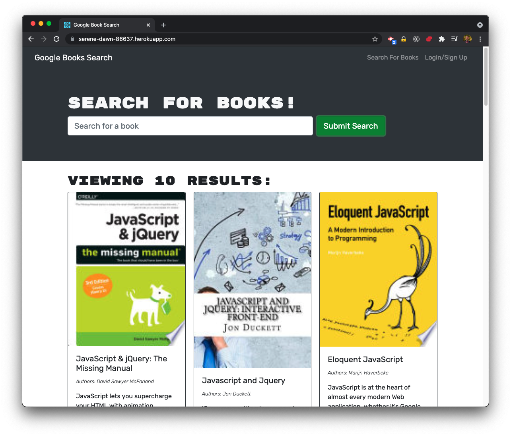
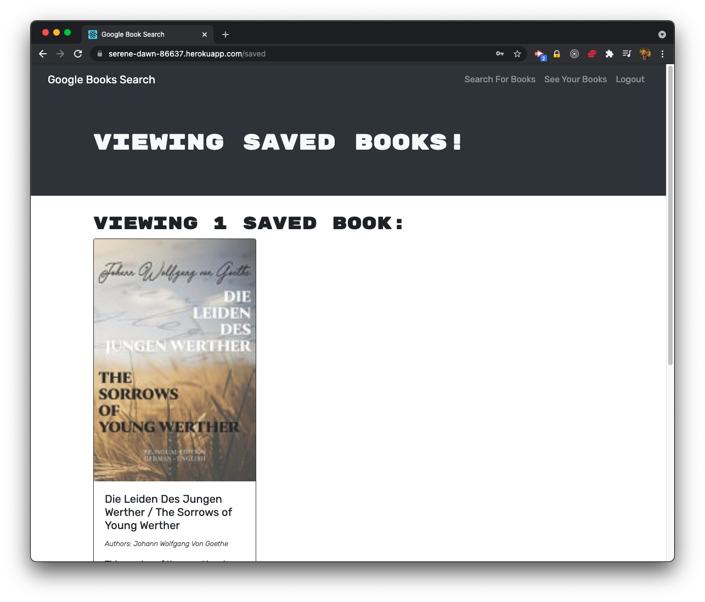
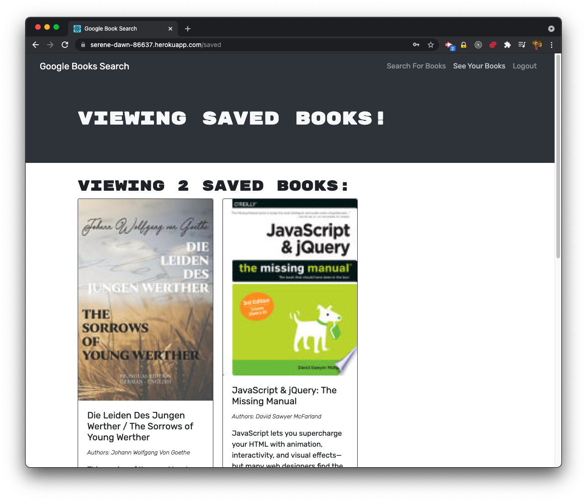

# Google Books (GraphQL and Apollo)

## Description

For this assignment, I refactored an existing, full-stack React application that was built using a RESTful API to use GraphQL and Apollo Client/Server.

## Table of Contents

- [Installation](#installation)
- [Usage](#usage)
- [Contribute](#contribute)
- [Test](#test)
- [License](#license)
- [Questions](#questions)

## Installation

You can install the project by downloading the files and installing the dependencies. You then need to configure your database, either locally or with MongoDB Atlas.

## Usage

You use the app by creating an account or signing in. You then search for books and can add them to your personal list of saved books. There is a link to view your saved books. There you can delete any unwanted books from your list.

## Contribute

Let me know how the code can be improved by email.

## Test

You can test the app by going to the deployed version or by downloading the code and running it locally.

## License

Copyright (c) Sam Gates. All rights reserved.
Licensed under the [MIT](https://opensource.org/licenses/MIT) license.

## Questions

Check out my [GitHub Profile](https://github.com/sg0703).

Email with questions! You can reach me at sam.j.gates@gmail.com.
